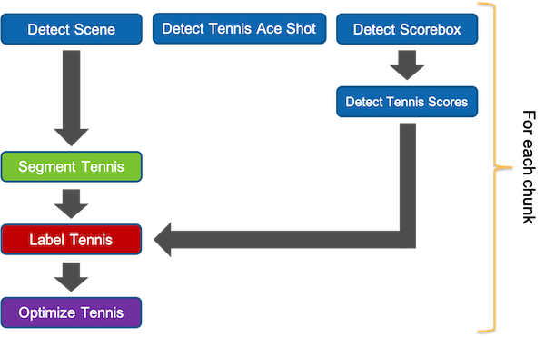

# Developers Guide - Profiles

Profiles in MRE exist to assemble the plugins and model configurations that are needed to accomplish a specific outcome. Sections for plugins classes exist where the desired plugins are linked together to form the skeleton of the pipeline that analyzes a specific type of video content.

In the example below, a basic tennis profile is shown that has four featurer class plugins, one segmenter plugin, one labeler and and one optimizer class plugin.  

Currently MRE supports one level of dependencies for featurer class plugins. In the example above, the **Detect Tennis Scores** plugin is dependent on the **Detect Scorebox** plugin. As a result, when the pipeline processes a video chunk, it will sequence the two plugin respectfully. The reason why this is setup this way is because the scorebox detection plugin results can be designed to be multi-sport for example. Then the appropriate score detection plugin can be applied to that result (tennis scores). This simplifies development when many different types of content (different sports) are needed to be processed.

Profiles should be created to support different types of content (sports, news or other types of material). Experimentation is made easier with profiles where you different versions can be created and results compared to determine more optimal settings to improve accuracy or latency for example.

The payload to the **profile** API takes a payload that is described here:

[POST /event](https://htmlpreview.github.io/?https://github.com/awslabs/aws-media-replay-engine/blob/main/docs/source/output/api/controlplane.html#create-profile)
